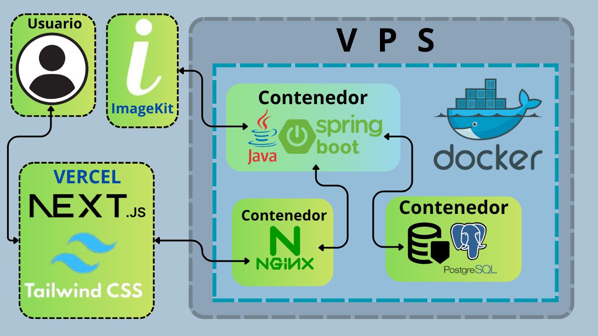
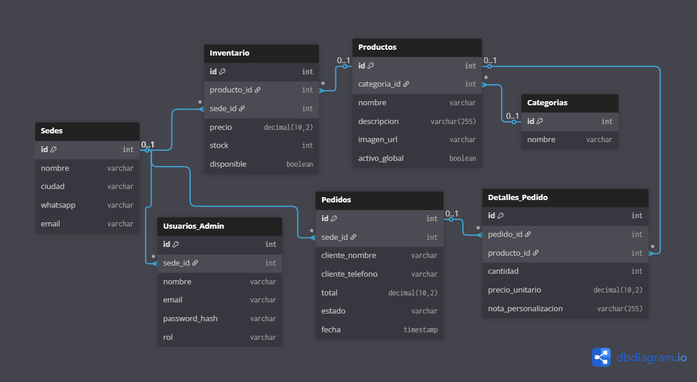

# Documentación del Proyecto: E-Commerce Multisede "Floristería"

## 1. Descripción del Problema y Justificación

Actualmente, una floristería en expansión opera con dos sedes físicas independientes ubicadas en diferentes ciudades (Bogotá y Medellín). La empresa busca digitalizar sus ventas mediante un catálogo en línea que les permita llegar a más clientes.

El problema radica en que ambas sedes **tienen independencia operativa**:

- Los costos de las flores pueden variar dependiendo de la ciudad.
- El inventario es independiente (un producto puede estar disponible en una ciudad y agotado en otra).
- El sistema actual no soporta gestión automatizada de pedidos y requiere alta interacción manual por WhatsApp, lo cual limita la capacidad de ventas y genera cuellos de botella en la atención.

Además, por tratarse de la primera incursión tecnológica del negocio, existe una restricción económica fuerte en cuanto al mantenimiento mensual y costos de servidores web.

### 1.1 Solución Propuesta

Desarrollar una aplicación web interactiva basada en una arquitectura Cliente-Servidor robusta y en contenedores (Docker). El núcleo del sistema contará con capacidades Multi-Tenant o Multi-inquilino desarrolladas a medida en el Backend para separar de forma segura el inventario, la disponibilidad y los costos operativos de cada sede. Se implementará un flujo ágil de "Carrito de compras a WhatsApp", donde el sistema armará de forma automatica el pedido del cliente.

Para la infraestructura, se ha diseñado un modelo de Hosting Híbrido Costo-Eficiente: delegando toda la carga visual y de imágenes a redes de distribución gratuitas de alto rendimiento (Vercel + ImageKit), y centralizando la lógica de negocio y base de datos en un Servidor Privado Virtual (VPS) económico. Esto garantiza a la floristería un sistema de nivel empresarial, con total propiedad sobre sus datos y un costo de mantenimiento mensual mínimo.

---

## 2. Roles de Usuario en el Sistema

- **Cliente / Visitante Público:** Cualquier persona que entre al sistema desde un navegador web.
- **Administrador de Sede:** Personal contratado en una sede específica (ej. Medellín). Solo controla el stock y visualiza pedidos correspondientes a su zona.
- **Superadministrador (Propietario):** Acceso total al negocio. Control maestro de los catálogos globales, sucursales y roles.

---

## 3. Historias de Usuario (User Stories)

### ÉPICA 1: Experiencia del Cliente Público (Vitrina Web)

- **HU-01: Selección de Sede.**
  - _Como_ Cliente, _quiero_ poder elegir la ciudad (Bogotá/Medellín) al entrar a la página web _para_ ver exclusivamente el catálogo y precios aplicables a mi ubicación.
- **HU-02: Catálogo y Categorías.**
  - _Como_ Cliente, _quiero_ navegar entre las diferentes categorías de arreglos florales (Cumpleaños, Amor, etc.) _para_ encontrar lo que busco rápidamente.
- **HU-03: Filtrado Inteligente de Stock.**
  - _Como_ Cliente, _espero_ que el catálogo únicamente muestre flores en estado "disponible" _para_ evitar comprar arreglos que están fuera de stock en mi ciudad elegida.
- **HU-04: Gestión de Carrito de Compras.**
  - _Como_ Cliente, _quiero_ poder agregar, modificar cantidades o quitar arreglos florales de un "Carrito de compras" visual, visualizando mi subtotal actualizado al instante, _para_ decidir cuánto quiero gastar.
- **HU-05: Notas de Personalización.**
  - _Como_ Cliente, _quiero_ un espacio de texto al momento de armar el producto donde pueda agregar personalización, notas al florista o una tarjeta adjunta al ramo.
- **HU-06: Checkout por WhatsApp.**
  - _Como_ Cliente, _quiero_ presionar un botón de "Realizar Pedido" que abra automáticamente la App de WhatsApp redirigido al número exclusivo de la Sede con un texto auto-formateado (Listado de producto, dedicatorias, valores), _para_ finalizar la compra rápidamente con un operador de la ciudad respectiva.

### ÉPICA 2: Administración y Operativa del Inventario (Admin de Sede)

- **HU-07: Ingreso Seguro.**
  - _Como_ Administrador de Sede, _quiero_ tener un inicio de sesión seguro en `/admin` con correo/contraseña y verificación de rol _para_ evitar fugas o manipulación externa al stock.
- **HU-08: Gestión de Inventario Local.**
  - _Como_ Administrador de Sede, _quiero_ acceder a la tabla `Inventario` viendo mi listado actual _para_ cambiar precios según promociones locales o establecer "Disponibilidad = False/Agotado" en los ítems vacíos sin que altere los catálogos en otra Sede diferente.
- **HU-09: Revisión de Órdenes Centralizadas.**
  - _Como_ Administrador de Sede, _quiero_ ver una grilla con todo el listado de pedidos pasados iniciados por clientes que interactuaron hacia mi sede _para_ reportes e histórico, aunque todo fluyó con cierre local en la atención del agente humano a mi celular/Whatsapp.

### ÉPICA 3: Operaciones Generales Multi-Tenant (Superadmin)

- **HU-10: Creador/Catálogo Master de Productos.**
  - _Como_ Superadmin, _quiero_ un creador maestro, subiendo solo UNA VEZ las hermosas fotografías del negocio base en HD y determinando Nombres / Descripciones / Status Global; y las categorías pre-asociadas del inventario que nutran los Inventarios Secundarios sin replicación cruzada.
- **HU-11: Creación Sedes Independientes.**
  - _Como_ Superadmin, _quiero_ agregar, editar números (celulares con +57XXXX para la integración enlace WhastApp) de sedes locales si mañana escalamos (ej. abrir Pereira o Cartagena) habilitándola en un clic a operar _para_ mayor cobertura corporativa rápida.
- **HU-12: Alta Usuarios Personalizados.**
  - _Como_ Superadmin, _quiero_ ingresar en un módulo las invitaciones dando permiso de "Superadmin" global ó "Admin + limitarlo exclusivamente a SEDE A / B " garantizando independencia por control del trabajador (Roles de usuario basados sobre IDs Null-able)

---

## 4. Arquitectura de Software y Stack Tecnológico 

Este proyecto está modelado bajo un paradigma cliente-servidor avanzado y distribuido. Separa las responsabilidades frontales (interfaz gráfica alojada en "El Borde" u "Edge Server") y el back-office empresarial interno centralizado en la nube por contenedores aislados que orquestan bases relacionales estrictas y control de recursos Multimedia.



### 4.1 Frontend (UI/UX) - Lado del Cliente

| Capa Tecnológica              | Tecnología Usada    | Descripción del Componente dentro de la Aplicación                                                                                                                                                                                                                                           |
| :---------------------------- | :------------------ | :------------------------------------------------------------------------------------------------------------------------------------------------------------------------------------------------------------------------------------------------------------------------------------------- |
| **Framework Base / UI**       | **Next.js (React)** | Se encargará del enrutamiento estricto y las renderizaciones tipo**SSR** (_Server Side Rendering_). Envía los datos cargados en milisegundos permitiendo un posicionamiento SEO en San Google potente frente al comercio de competencia común (No deja una pantalla en "Blanco / Cargando"). |
| **Sistema De Estilos**        | **Tailwind CSS**    | Herramienta pura sobre*clases de utilidad* implementando "Mobile-first" puro al 100%. Genera una app responsiva súper amigable y sutil al móvil evitando enormes CSS rotos por código basura con alta maleabilidad para botones estilo botánicos e imagen.                                   |
| **Infraestructura Edge/Host** | **Vercel**          | Aquí recaerá el empaquetado inicial HTML y el tráfico al puerto HTTPs público, agiliza descargas delegando costos nulos y librándonos mantenimientos para escalar peticiones pico como en "Día De Las Madres".                                                                               |

### 4.2 Backend

Su responsabilidad única e inquebrantable será recibir las acciones que unifica Nginx o realizar actualizaciones por Administradores de Zona devolviendo formato crudo rápido al puerto delantero mediante comunicación exclusiva a puertos `API/Json`.

| Capa Tecnológica                   | Tecnología Usada               | Descripción del Componente dentro de la Aplicación                                                                                                                                                                                           |
| :--------------------------------- | :----------------------------- | :------------------------------------------------------------------------------------------------------------------------------------------------------------------------------------------------------------------------------------------- |
| **Plataforma Engine Core**         | **Java 17/21 + Spring Boot 3** | Es "La Sala de Maquinas Empresarial". El potente y riguroso modelo programado validará precios diferenciados por SEDE , RBAC roles para JWT Auth. No perderá RAM con el tiempo gestionando eficientemente cada carrito.                      |
| **O.R.M Interno (Modelado DB)**    | **Data JPA / Hibernate**       | Herramienta del Framework Spring mediante @Anotaciones que unirá inteligentemente esas conexiones de tablas "Inventario Pivote a Productos Sedes", gestionando la SQL pesada sin redactarla puramente cada vez al mandar y restar elementos. |
| **Almacén Principal Base / RDBMS** | **PostgreSQL (v.15/16)**       | La Base centralizada (Aislada a redes por su contenedor 5432 solo a BackEnd). La base maneja reglas relacionales complejas e ideal bajo consultas Multi-tenant entre inventarios sin fallas tipo colisión.                                   |

### 4.3 Elemento Externos

| Capa Tecnológica                     | Tecnología Usada | Descripción del Componente dentro de la Aplicación                                                                                                                                                                                                                                                                                                                                                                                                                                                                                                       |
| :----------------------------------- | :--------------- | :------------------------------------------------------------------------------------------------------------------------------------------------------------------------------------------------------------------------------------------------------------------------------------------------------------------------------------------------------------------------------------------------------------------------------------------------------------------------------------------------------------------------------------------------------- |
| **Content Network Media (Imágenes)** | **ImageKit.io**  | Nuestra librería paralela externa al VPS vía SDK Java . Al subir administrador su nuevo Producto foto, "Spring" desvía inmediatamente dicha fotografía enviando su tamaño enorme (MB) a la pasarela (Cloud Mágic/ImageKit) recibiendo su propia ruta generada url de `https/IMGKIT.url/`. A continuación su principal punto a Next js (FRONT), la mostrará autogenerándose comprimida e invisible unificándolo con WebP/Next a <~40 KB>!. Sin destruir servidor Base en peticiones recurrentes al móvil y velocidad del comprador al máximo sin colapsos |

### 4.4 Infraestructura de Despliegue en Máquina e IPS "On Cloud"

| Capa Tecnológica                             | Tecnología Usada                                        | Descripción del Componente dentro de la Aplicación                                                                                                                                                                                                                                                                                                                                                                                                                                        |
| :------------------------------------------- | :------------------------------------------------------ | :---------------------------------------------------------------------------------------------------------------------------------------------------------------------------------------------------------------------------------------------------------------------------------------------------------------------------------------------------------------------------------------------------------------------------------------------------------------------------------------- |
| **Gestión Virtual "Host-Machine"**           | **VPS / Sistema Linux-Ubuntu Server.**                  | Servidor físico fraccionado (Señalaremos máquinas muy estables Contabo/Hetzner para su control de gasto <10 USD al mes ).                                                                                                                                                                                                                                                                                                                                                                 |
| **Control Aislamiento (Containers)**         | **DOCKER (Y Compose)**                                  | Genera su bloque (1 Bloque por Spring Boot Image), ( 1 Contenedor "Virtual Postgres aislándolo") que interconecta sobre variables `environment/red virtual bridge`. No rompes todo a un fallo ajeno. Migraciones garantizada instalando docker de PC A / C al toque!                                                                                                                                                                                                                      |
| **Security - Puerta de Acceso Reverso Web:** | **N G I N X (+ SSL CERTBOT Lets.Crypts/Proxy manager)** | Instanciando y escuchando la salida en los puertos "Web (80 / 443 HTTPS )". NGINX atiende solo clientes (bloqueando ataques Bots comunes en la calle). Provee al mismo tiempo ese "Candado verde gratuito SSL web," interceptándolo antes que impacte todo pasando limpio solo "A La petición local interna escondida a Contenedores Java". Él permite crear también la habilitación o Permiso del origen externo a nuestras `C.O.R.S Header Origin de Vercel/Web` del sitio front web 1. |

---

## 5. Arquitectura de Datos



```dbml
Table Sedes {
  id int [pk, increment]
  nombre varchar
  ciudad varchar // Bogotá o Medellín
  whatsapp varchar // A dónde llegará el mensaje
  email varchar // A dónde llegará el mensaje
}

Table Categorias {
  id int [pk, increment]
  nombre varchar // Ej: Condolencias, Cumpleaños
}

Table Productos {
  id int [pk, increment]
  categoria_id int [ref: > Categorias.id]
  nombre varchar
  descripcion varchar(255)
  imagen_url varchar
  activo_global boolean [default: true] // Para ocultar el producto en TODAS las sedes de un golpe
}

Table Inventario {
  id int [pk, increment]
  producto_id int [ref: > Productos.id]
  sede_id int [ref: > Sedes.id]
  precio bigdecimal
  stock int
  disponible boolean [default: true]
  // Una sola fila por producto+sede Evita que por error existan dos registros de 'rosas rojas' para Bogotá.
  indexes {
    (producto_id, sede_id) [unique]
  }
}

Table Pedidos {
  id int [pk, increment]
  sede_id int [ref: > Sedes.id]
  cliente_nombre varchar
  cliente_telefono varchar
  total bigdecimal
  estado varchar [default: 'Pendiente'] // Pendiente, Completado, Cancelado
  fecha timestamp [default: `now()`]
}

Table Detalles_Pedido {
  id int [pk, increment]
  pedido_id int [ref: > Pedidos.id]
  producto_id int [ref: > Productos.id]
  cantidad int
  precio_unitario bigdecimal // Se guarda para el historial, por si el precio cambia en el futuro
  nota_personalizacion varchar(255) //  "con dedicatoria", "sin moño", etc.
}

// -- ADMINISTRACIÓN --

Table Usuarios_Admin {
 id int [pk, increment]
 sede_id int [ref: > Sedes.id, null] // null = super-admin
 email varchar [unique]
 password_hash varchar
 rol varchar [default: 'admin'] // 'superadmin' | 'admin'
}
```

Para soportar la regla de negocio Multi-Sede sin duplicar información, la base de datos se ha normalizado separando el catálogo visual de la realidad física del inventario. A continuación, el propósito de cada entidad principal:

- **`Sedes`:** Representa las sucursales físicas del negocio (Ej: Bogotá, Medellín). Es vital porque almacena el número de `whatsapp` específico al que el sistema redirigirá los pedidos de esa ciudad.
- **`Categorias`:** Agrupación lógica para facilitar la navegación del cliente en el Frontend (Ej: "Ramos de Amor", "Condolencias").
- **`Productos` (Catálogo Global):** Es la vitrina maestra. Almacena la información "inmutable" de una flor: su nombre, descripción y la URL de su fotografía en alta calidad. **Nota arquitectónica:** Esta tabla _no contiene precio ni stock_, ya que estos valores son relativos a la ubicación geográfica.
- **`Inventario` (Tabla Pivote / Core del Negocio):** Es el corazón del sistema Multi-Tenant. Resuelve la intersección entre un `Producto` y una `Sede`. Aquí es donde realmente se define cuánto cuesta un arreglo floral en una ciudad específica, cuántas unidades quedan (`stock`) y si el administrador local lo ha marcado como agotado (`disponible`).
- **`Pedidos` y `Detalles_Pedido`:** Aunque el cierre de la venta ocurre en WhatsApp, el sistema registra la intención de compra. Esto permite al Superadministrador tener métricas, historial de ventas y trazabilidad de qué sede está generando más conversiones.
- **`Usuarios_Admin`:** Gestiona el control de acceso (RBAC). Utiliza un diseño inteligente donde el campo `sede_id` puede ser nulo (`null`). Si un usuario tiene una sede asignada, su vista estará restringida a su ciudad. Si su `sede_id` es nulo, el sistema lo eleva automáticamente a "Superadministrador" con visión global.

## 6. Estructura del Proyecto

Para garantizar la escalabilidad y el mantenimiento del código en Spring Boot, se implementará un patrón estricto de Arquitectura por Capas (Layered Architecture). El código fuente se dividirá en los siguientes paquetes lógicos:

- `config/`: Configuraciones globales del sistema (Filtros CORS, Beans de Spring Security, inicialización de ImageKit).
- `controller/`: Capa de exposición (Endpoints REST). Recibe peticiones HTTP, delega al servicio y retorna respuestas estandarizadas.
- `dto/`: _Data Transfer Objects_. Clases planas para recibir (Requests) y enviar (Responses) datos, evitando exponer las Entidades de la base de datos directamente.
- `entity/`: Modelos de dominio mapeados a la base de datos mediante anotaciones JPA/Hibernate.
- `exception/`: Manejo global de errores (`@ControllerAdvice`) para capturar excepciones y devolver JSONs estructurados
- `repository/`: Interfaces de Spring Data JPA para la persistencia y consultas a PostgreSQL.
- `service/`: Capa de lógica de negocio. Aquí residen las reglas estrictas (validación de stock por sede, cálculo de totales).
- `security/`:

## 7. Estrategia de Seguridad Integral

La seguridad del sistema se abordará bajo un enfoque de "Defensa en Profundidad" (Dos muros de contención):

### 7.1 Seguridad a Nivel de Aplicación (Código)

- **Autenticación y Autorización:** Implementación de Spring Security con tokens **JWT (JSON Web Tokens)**. Acceso restringido al panel `/admin` basado en el Rol y el `sede_id` del usuario (Multi-tenant isolation).
- **Cifrado de Credenciales:** Uso del algoritmo **BCrypt** para el hasheo de contraseñas en la base de datos.
- **Protección CORS:** Configuración estricta para aceptar únicamente peticiones provenientes del dominio oficial del Frontend (Vercel).
- **Validación de Datos:** Uso de `spring-boot-starter-validation` para sanitizar y validar los DTOs entrantes.

### 7.2 Seguridad a Nivel de Infraestructura (DevOps)

- **Aislamiento de Base de Datos:** El puerto `5432` de PostgreSQL permanecerá cerrado al exterior mediante Firewall (UFW), accesible únicamente por la red interna de Docker.
- **Gestión de Secretos:** Prohibición estricta de credenciales "quemadas" (hardcoded) en el código. Uso exclusivo de Variables de Entorno (`.env`) inyectadas en el `application.yml`.
- **Cifrado en Tránsito:** Implementación de Proxy Reverso (Nginx) con certificados SSL/TLS (Let's Encrypt) para forzar tráfico HTTPS.

## 8. Hoja de Ruta de Desarrollo (Roadmap Actualizado)
Para garantizar entregas funcionales y testeables desde el primer día, el proyecto abandonó el desarrollo tradicional por capas horizontales y adoptó un enfoque de **Vertical Slicing (Desarrollo Orientado a Funcionalidades)** a partir de la Fase 4.

*   **[x] Fase 1: Setup Base.** Configuración de dependencias (POM), conexión a PostgreSQL local vía Docker y `application.yml`.
*   **[x] Fase 2: Capa de Datos (Entidades).** Creación de Entidades JPA con relaciones estrictas orientadas a objetos (`@ManyToOne`, `@OneToMany`).
*   **[x] Fase 3: Capa de Acceso (Repositorios).** Creación de interfaces Spring Data JPA con *Derived Queries* optimizadas para el aislamiento Multi-Tenant.
*   **[x] Fase 4: Corte Vertical 1 (Épica 1 - Vitrina Web).** Desarrollo acoplado de DTOs, Servicios y Controladores para la consulta pública del catálogo filtrado por Sede.
*   **[x] Fase 5: Corte Vertical 2 (Épica 1 - Checkout).** Desarrollo del motor transaccional para la creación de Pedidos y Detalles de Pedido.
*   **[x] Fase 6: Seguridad y Autenticación.** Implementación de Spring Security, encriptación BCrypt y emisión de tokens JWT.
*   **[x] Fase 7: Corte Vertical 3 (Épica 2 - Panel Admin).** Endpoints protegidos para la gestión de inventario local 
*   **[x] Fase 8: Corte Vertical 4 (Épica 3 - Superadmin).** Endpoints maestros para la creación de Productos Globales (Integración con ImageKit) y gestión de Sedes/Usuarios.
*   **[ ] Fase 9: Frontend.** Desarrollo de la UI en Next.js + Tailwind, consumo de la API y lógica del Carrito/WhatsApp.
*   **[ ] Fase 10: Despliegue (Producción).** Configuración del VPS, Docker Compose de producción, Nginx y despliegue en Vercel.